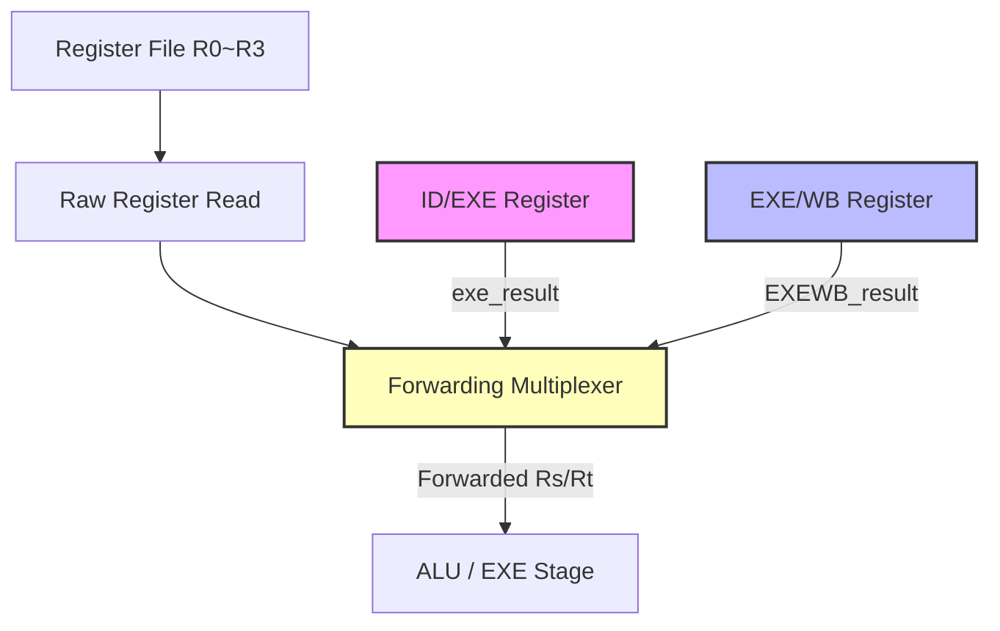

# 2026年微處理器系統期末專案報告：四階段管線中央處理器設計與實作

## 實驗基本資訊
*   **實驗主題**：四階段管線中央處理器設計與實作 (4-Stage Pipeline CPU Design & Implementation)
*   **班級**：資訊工程學系
*   **學號/姓名**：
    *   `113590051` 楊承諭 (實作組，負責核心架構與程式撰寫，貢獻度 65%)
    *   `113590017` 黃楷程 (報告組，負責測資驗證與報告彙整，貢獻度 35%)
*   **組別**：第 19 組
*   **實驗日期**：2026年6月26日

---

## 一、 實驗目的與專案要求
本期末專案的目標是在 Altera DE2-115 開發板（Cyclone IV E 晶片）上，使用 **VHDL 語言**設計並實作一個**四階段管線中央處理器（4-Stage Pipeline CPU）**。本專案核心要求如下：
1.  **管線化設計**：所有指令的執行均須以管線（Pipeline）方式實現，包含四個階段：
    *   **IF (Instruction Fetch)**：讀取指撥開關的指令與資料。
    *   **ID (Instruction Decode / Register Read)**：解碼並讀取暫存器陣列，進行前饋判斷。
    *   **EXE (Execution)**：執行 ALU 運算或啟動多時序除法器。
    *   **WB (Write Back)**：將運算結果寫回暫存器檔案。
2.  **資料衝突與前饋機制 (Data Hazard & Forwarding)**：必須設計 Forwarding Unit，自動偵測並處理 **EXE 階段與 WB 階段的資料衝突**，使得單週期指令（LOAD, MOVE, ADD 等）在發生相依性時能夠 **Zero-Stall** 連續執行，並以綠色 LED 燈 `LEDG[0]` 即時指示衝突發生。
3.  **多時序除法器 (Multi-cycle DIV) 與管線暫停 (Stall)**：進階功能要求實作符合 Lab 7 規格的**移位相減式除法器（Restoring Division）**，對 8-bit 資料進行多時序（8 clocks）除法運算。除法執行期間管線必須正確暫停（Stall）其他階段，插入氣泡（Bubble）以防止 WB 誤寫回，並以綠色 LED 燈 `LEDG[1]` 顯示 `exe_busy`（管線暫停狀態）。此外需具備**除以零防錯與 Bypass 機制**，若除數為 0 則不進行 8 週期 Stall，直接輸出錯誤碼 `0xFF`。
4.  **硬體周邊與顯示驅動**：
    *   使用七段顯示器即時顯示 Rs、Rt 暫存器之數值（十六進制 `00`~`FF`）。
    *   使用七段顯示器分別顯示當前的輸入指令 Opcode、IF/ID 管線暫存器 Opcode，以及 ID/EXE 管線暫存器 Opcode。
    *   使用紅色 LED `LEDR[7:0]` 顯示當前指撥開關輸入的 8 位元立即值（Data）。

---

## 二、 核心硬體架構與規格設計

### 1. 微架構管線暫存器定義
為了在硬體上實現 4-stage 管線，我們定義了三組管線暫存器（Pipeline Registers）來劃分各階段邊界，並在每個 Clock 正緣（即手動按鍵 `KEY[0]` 被按下並釋放時）同步更新：
*   **IF/ID 暫存器**：鎖存自 `SW[15:0]` 擷取的指令欄位。
    *   `IFID_opcode` (4-bit)：存儲當前指令操作碼。
    *   `IFID_rs_id` (2-bit)：存儲目標暫存器選擇子。
    *   `IFID_rt_id` (2-bit)：存儲來源暫存器選擇子。
    *   `IFID_data` (8-bit)：存儲 8 位元立即值。
*   **ID/EXE 暫存器**：鎖存解碼完成、暫存器讀取（或前饋後）的運算元。
    *   `IDEXE_opcode` (4-bit)
    *   `IDEXE_rs_id` (2-bit)
    *   `IDEXE_rs_val` (8-bit)：前饋或暫存器檔案讀出的 Rs 數值。
    *   `IDEXE_rt_id` (2-bit)
    *   `IDEXE_rt_val` (8-bit)：前饋或暫存器檔案讀出的 Rt 數值。
    *   `IDEXE_data` (8-bit)：傳遞給 EXE 階段的 LOAD 立即值。
*   **EXE/WB 暫存器**：鎖存 EXE 階段 ALU 或除法狀態機的最終結果，準備在 WB 階段寫回。
    *   `EXEWB_opcode` (4-bit)
    *   `EXEWB_rs_id` (2-bit)：寫回目標暫存器 ID。
    *   `EXEWB_result` (8-bit)：寫回資料。

### 2. 資料前饋單元 (Forwarding Unit) 設計邏輯
當後續指令需要讀取前序指令尚未寫回暫存器檔案（Register File）的最新結果時，會產生資料衝突（Data Hazard）。本處理器設計了完整的前饋機制，其邏輯架構如下：



*   **衝突偵測邏輯**：
    我們需要確認當前處於 ID 階段的指令是否確實需要讀取 `Rs` 或 `Rt` 暫存器。若指令為 `LOAD`（僅寫入 `Rs`）或 `NOP`，則不應參與前饋判定。
    *   `reads_rs` 成立條件：指令為 `ADD`, `AND`, `SLT`, `SUB(A-B)`, `NOR`, `SUB(B-A)`, `DIV`。
    *   `reads_rt` 成立條件：指令為上述運算指令，或 `MOVE`（讀取 `Rt` 複製到 `Rs`）。
*   **EXE 階段衝突前饋 (EXE Forwarding)**：
    若 ID 階段讀取的暫存器與處於 EXE 階段的指令寫回暫存器相符，且 EXE 階段指令有效，則直接前饋 `exe_result`。
    $$\text{fwd\_rs\_exe} = \text{reads\_rs} \land \text{IDEXE\_valid} \land (\text{IDEXE\_opcode} \neq \text{NOP}) \land (\text{IDEXE\_rs\_id} = \text{IFID\_rs\_id})$$
    $$\text{fwd\_rt\_exe} = \text{reads\_rt} \land \text{IDEXE\_valid} \land (\text{IDEXE\_opcode} \neq \text{NOP}) \land (\text{IDEXE\_rs\_id} = \text{IFID\_rt\_id})$$
*   **WB 階段衝突前饋 (WB Forwarding)**：
    若 ID 階段讀取的暫存器與處於 WB 階段的指令寫回暫存器相符，且 WB 階段指令有效，且未被 EXE 階段的前饋（較新的值）覆蓋，則前饋 `EXEWB_result`。
    $$\text{fwd\_rs\_wb} = \text{reads\_rs} \land \text{EXEWB\_valid} \land (\text{EXEWB\_opcode} \neq \text{NOP}) \land (\text{EXEWB\_rs\_id} = \text{IFID\_rs\_id}) \land \neg\text{fwd\_rs\_exe}$$
    $$\text{fwd\_rt\_wb} = \text{reads\_rt} \land \text{EXEWB\_valid} \land (\text{EXEWB\_opcode} \neq \text{NOP}) \land (\text{EXEWB\_rs\_id} = \text{IFID\_rt\_id}) \land \neg\text{fwd\_rt\_exe}$$
*   **衝突指示燈**：
    若對任何一個有效指令啟動了前饋機制（`fwd_rs_exe`、`fwd_rs_wb`、`fwd_rt_exe` 或 `fwd_rt_wb` 為真），則綠色 LED `LEDG[0]` 會即時亮起。

### 3. 多時序除法狀態機與管線 Stall 機制
除法指令 `DIV Rs, Rt` 需要多個 Clock 進行移位相減運算，無法在單個時脈週期內完成。我們在 EXE 階段設計了一個 Restoring Division 有限狀態機（FSM）：

```
   [DIV_IDLE] --(IFID_opcode = OP_DIV && divisor != 0)--> [DIV_RUN]
        ^                                                    |
        |                                               (count = 7)
        |                                                    v
   [DIV_DONE] <----------------------------------------------+
```

*   **DIV_IDLE**：空閒狀態。當偵測到即將進入 ID/EXE 暫存器的指令為 `DIV`，且除數不為 0 時，於時脈正緣載入被除數 `Rs_val_fwd` 至 `div_dividend`，除數 `Rt_val_fwd` 至 `div_divisor`，並跳轉至 `DIV_RUN`，計數器 `div_count` 歸零。
*   **DIV_RUN**：執行 8-bit 恢復除法演算法。每個時脈執行以下步驟：
    1.  將餘數暫存器 `div_rem` 左移 1 位，並讀入被除數 `div_dividend` 的最高位元。
    2.  比較此暫時值是否大於等於除數 `div_divisor`。
    3.  若大於等於，則 `div_rem` 扣除 `div_divisor`，且商數 `div_quot` 的對應位元置為 `1`。
    4.  若小於，則 `div_rem` 保持原值，商數該位元保持 `0`。
    5.  `div_count` 遞增，直到第 8 個時脈（計數值為 7）計算完畢後跳轉至 `DIV_DONE`。
*   **DIV_DONE**：除法運算結束。在此狀態下，商數 `div_quot` 輸出至 `exe_result`，狀態機在下一個時脈回到 `DIV_IDLE`。

#### 管線暫停 (Stall) 與氣泡插入 (Bubble) 控制：
當狀態機處於 `DIV_RUN` 狀態時，`stall` 訊號為 `1`。管線控制器在此期間進行以下時序操作：
1.  **凍結上游階段**：不對 `IF/ID` 和 `ID/EXE` 管線暫存器進行更新。此時，指撥開關的輸入與解碼出的暫存器值保持鎖定。
2.  **插入氣泡（Bubble）**：為了防止 EXE/WB 暫存器在管線暫停期間重複寫入無效資料，管線暫存器 `EXEWB` 會被強制寫入 `OP_NOP` (1111) 且 `valid` 設為 `0`。這代表將一個「氣泡」送入 WB 階段，避免管線寫回暫存器。
3.  **除法結束推進**：當狀態機進入 `DIV_DONE`，`stall` 降為 `0`，`exe_result` 順利傳遞給 `EXE/WB`，管線恢復正常推進。

#### 除以零防錯 Bypass：
若在 `DIV_IDLE` 狀態下偵測到除數（`Rt_val_fwd`）為 `0`，狀態機將**直接進入 `DIV_DONE` 狀態**，並將結果 `div_quot` 設為錯誤碼 `0xFF`。因為不經過 `DIV_RUN`，`stall` 訊號保持為 `0`。這使得除以零指令能像單週期指令一樣 **Zero-Stall** 快速流過管線，並在 WB 階段正確將 `0xFF` 寫入 Rs，完美符合專案的防錯 Bypass 要求。

---

## 三、 硬體週邊配置與腳位對照表

本專案在 Quartus II 軟體中將實體 I/O 腳位與 DE2-115 開發板進行了完全綁定。以下為腳位配置對照表：

### 1. 指撥開關（輸入）與按鈕時脈
| 埠名稱 (Port) | 位元寬度 | 對應板載硬體週邊 (Component) | FPGA 晶片腳位 (Pin) |
| :--- | :---: | :--- | :--- |
| `KEY[0]` | 1 | 系統手動時脈輸入（手動按鍵，按下觸發） | `PIN_M23` |
| `SW[7]` ~ `SW[0]` | 8 | 8位元立即值資料輸入（Data / Immediate） | `PIN_AB26` ~ `PIN_AB28` 等 |
| `SW[11]` ~ `SW[8]` | 4 | 4位元指令操作碼輸入（Opcode） | `PIN_AB24`, `PIN_AC24`, `PIN_AB25`, `PIN_AC25` |
| `SW[13]` ~ `SW[12]`| 2 | 目標暫存器選擇子（Rs register select） | `PIN_AA24`, `PIN_AB23` |
| `SW[15]` ~ `SW[14]`| 2 | 來源暫存器選擇子（Rt register select） | `PIN_AA22`, `PIN_AA23` |

### 2. 七段顯示器與 LED 燈（輸出）
| 埠名稱 (Port) | 位元寬度 | 對應板載硬體週邊 (Component) | FPGA 晶片腳位 (Pin) |
| :--- | :---: | :--- | :--- |
| `HEX1`, `HEX0` | 14 | Rs 暫存器數值顯示（HEX1十位、HEX0個位，範圍 `00`~`FF`） | `PIN_M24`~`PIN_U24`, `PIN_G18`~`PIN_H22` |
| `HEX3`, `HEX2` | 14 | Rt 暫存器數值顯示（HEX3十位、HEX2個位，範圍 `00`~`FF`） | `PIN_V21`~`PIN_Y19`, `PIN_AA25`~`PIN_W28` |
| `HEX4` | 7 | IF/ID 管線暫存器中鎖存之指令 Opcode (顯示 `0`~`F`) | `PIN_AB19` ~ `PIN_AE18` |
| `HEX5` | 7 | Live 即時輸入之指令 Opcode（隨 SW[11:8] 即時變動） | `PIN_AD18` ~ `PIN_AH18` |
| `HEX6` | 7 | ID/EXE 管線暫存器中鎖存之指令 Opcode (顯示 `0`~`F`) | `PIN_AA17` ~ `PIN_AC17` |
| `LEDR[7:0]` | 8 | 紅色 LED，即時顯示例立值資料數值（`SW[7:0]`） | `PIN_G19` ~ `PIN_H19` 等 |
| `LEDG[0]` | 1 | 綠色 LED，資料衝突與前饋指示器（Hazard Detected） | `PIN_E21` |
| `LEDG[1]` | 1 | 綠色 LED，除法器 Busy/管線暫停指示器（Exe Busy） | `PIN_E22` |

---

## 四、 VHDL 原始碼架構分析

本系統完全實作於單個 VHDL 檔案 [Pipeline_CPU.vhd](file:///home/chengyu/%E6%A1%8C%E9%9D%A2/Microcomputer_System/Finial_Project/pipiline/Pipeline_CPU.vhd) 中，程式結構清晰，劃分為模組化的組合邏輯電路與同步時序電路：

### 1. 實體定義與 7 段解碼邏輯
`to_7seg` 函式將 4-bit 的十六進制數值解碼為主動低電位（Active-Low）的七段顯示器段碼。例如，`0000` 被解碼為 `"1000000"`（顯示 0），`1111` 解碼為 `"0001110"`（顯示 F）。這確保了暫存器值與 Opcode 在開發板上呈現清晰的十六進制。

### 2. 資料路徑組合邏輯：暫存器讀取與前饋選擇器
為了確保 Zero-Stall 前饋，暫存器檔案的讀取與 Forwarding 邏輯必須是組合邏輯（即時運算）。
程式中透過以下敏感度清單 Process，動態分析目前 `IF/ID` 指令是否與下游暫存器發生 Hazard：
```vhdl
-- 節錄自 Pipeline_CPU.vhd (組合邏輯前饋單元)
process(IFID_rs_id, IFID_rt_id, IFID_valid, IFID_opcode,
        IDEXE_rs_id, IDEXE_valid, IDEXE_opcode,
        EXEWB_rs_id, EXEWB_valid, EXEWB_opcode,
        Rs_val_raw, Rt_val_raw, exe_result, EXEWB_result)
...
begin
    -- 1. 判斷當前指令是否讀取暫存器 Rs, Rt (以屏蔽 LOAD / NOP 的誤判)
    if IFID_opcode = OP_ADD or ... then
        reads_rs_v := true; reads_rt_v := true;
    elsif IFID_opcode = OP_MOVE then
        reads_rs_v := false; reads_rt_v := true;
    else
        reads_rs_v := false; reads_rt_v := false;
    end if;

    -- 2. EXE Forwarding 偵測 (優先級最高，從 EXE 階段直接拉回)
    fwd_rs_exe := reads_rs_v and (IDEXE_valid = '1') and (IDEXE_opcode /= OP_NOP) and (IDEXE_rs_id = IFID_rs_id);
    fwd_rt_exe := reads_rt_v and (IDEXE_valid = '1') and (IDEXE_opcode /= OP_NOP) and (IDEXE_rs_id = IFID_rt_id);

    -- 3. WB Forwarding 偵測 (優先級次之，從 WB 寫回暫存器拉回)
    fwd_rs_wb := reads_rs_v and (EXEWB_valid = '1') and (EXEWB_opcode /= OP_NOP) and (EXEWB_rs_id = IFID_rs_id) and (not fwd_rs_exe);
    fwd_rt_wb := reads_rt_v and (EXEWB_valid = '1') and (EXEWB_opcode /= OP_NOP) and (EXEWB_rs_id = IFID_rt_id) and (not fwd_rt_exe);

    -- 4. 前饋多路選擇器 (Mux)
    if fwd_rs_exe then Rs_val_fwd <= exe_result;
    elsif fwd_rs_wb then Rs_val_fwd <= EXEWB_result;
    else Rs_val_fwd <= Rs_val_raw;
    end if;
    ...
```
這種設計使得暫存器讀取端能夠在時脈正緣來臨前，就經由前饋路徑獲得最即時、正確的資料。

### 3. 多時序除法演算法組合與時序邏輯
多時序除法 FSM 在同步 Process 中更新狀態。在 `DIV_RUN` 狀態下，`stall` 訊號為真，這會阻止其餘管線暫存器的前進：
```vhdl
-- 節錄自 Pipeline_CPU.vhd (同步時序 Process 中的 Stall 分支)
if stall = '0' then
    -- 正常管線推進：WB 寫回暫存器、管線暫存器向前推進
    if EXEWB_valid = '1' and EXEWB_opcode /= OP_NOP then
        -- 寫回暫存器檔案
        case EXEWB_rs_id is ...
    end if;
    EXEWB_opcode <= IDEXE_opcode;
    IDEXE_opcode <= IFID_opcode;
    IFID_opcode  <= curr_opcode;
    ...
else
    -- 管線暫停 (DIV Stall)
    -- 1. WB 階段仍處理寫回 (第一週期完成前序指令，後續週期為氣泡)
    if EXEWB_valid = '1' and EXEWB_opcode /= OP_NOP then
        case EXEWB_rs_id is ...
    end if;
    -- 2. 插入氣泡 (Bubble) 進入 EXE/WB 暫存器
    EXEWB_opcode <= OP_NOP;
    EXEWB_valid  <= '0';
    -- 3. IFID 與 IDEXE 保持原值 (鎖定)
    -- 4. 僅除法器狀態機往前推進
    if div_state = DIV_RUN then
        bit_pos  := 7 - div_count;
        temp_rem := div_rem(6 downto 0) & div_dividend(bit_pos);
        if temp_rem >= div_divisor then
            div_rem <= temp_rem - div_divisor;
            div_quot(bit_pos) <= '1';
        else
            div_rem <= temp_rem;
        end if;
        ...
```
此結構精確實現了管線氣泡插入技術（Pipeline Bubbling），在硬體層面上消除了因除法延遲導致的多重寫回衝突。

---

## 五、 測試資料與板載硬體驗證

我們設計了 **5 組代表性測試情境**，完整覆蓋了基本運算、EXE 衝突前饋、EXE 與 WB 同時衝突前饋、多時序除法暫停，以及除以零 Bypass 功能。以下為詳細時序與硬體狀態分析：

### 1. 測資 1：基本暫存器載入與算術運算（無 Hazard）
*   **目的**：驗證管線在無衝突狀態下的基本流動與運算正確性。
*   **指令時序序列**：
    1.  `Cycle 1`: `LOAD R1, 0x05` (R1 載入 5) ── `SW = 0x1005`
    2.  `Cycle 2`: `LOAD R2, 0x07` (R2 載入 7) ── `SW = 0x2007`
    3.  `Cycle 3`: `NOP` (空指令) ── `SW = 0x0F00`
    4.  `Cycle 4`: `NOP` (空指令) ── `SW = 0x0F00`
    5.  `Cycle 5`: `ADD R1, R2` (R1 <= R1 + R2 = 12) ── `SW = 0x9200`
    6.  `Cycle 6~8`: 持續輸入 `NOP` (`SW = 0x0F00`) 以排空管線。
*   **預期與實測結果**：
    *   在 `Cycle 4` 結束後，暫存器 `R1` 的寫回完成。此時撥碼開關設定 Rs 選擇 `R1`，七段顯示器 `HEX1/0` 靜態顯示 `05`，Rt 選擇 `R2` 時 `HEX3/2` 顯示 `07`。
    *   在 `Cycle 8` 結束後，`ADD` 指令執行並寫回完畢。`HEX1/0` 正確顯示結果 `0C` (十六進制 12)。
    *   整個過程中，綠色 LED `LEDG[0]` (Hazard) 保持熄滅。

### 2. 測資 2：EXE 階段資料衝突與前饋 (EXE Forwarding)
*   **目的**：驗證當下一道指令需要使用「前一次運算（尚在 EXE 階段）的結果」時，前饋單元能否 Zero-Stall 正確運作。
*   **指令時序序列**：
    1.  `Cycle 1`: `LOAD R1, 0x0A` (R1 載入 10) ── `SW = 0x100A`
    2.  `Cycle 2`: `LOAD R2, 0x03` (R2 載入 3) ── `SW = 0x2003`
    3.  `Cycle 3`: `SUB(A-B) R1, R2` (R1 <= R1 - R2 = 7) ── `SW = 0x9500`
    4.  `Cycle 4`: `AND R1, R2` (R1 <= R1 AND R2 = 7 AND 3 = 3) ── `SW = 0x9300`
        *(註：此指令讀取 R1，而上一個指令的 R1 運算結果尚在 EXE 暫存器中)*
    5.  `Cycle 5~7`: 持續輸入 `NOP` (`SW = 0x0F00`)。
*   **預期與實測結果**：
    *   在 `Cycle 4` 時，`AND` 指令處於 Decode 階段，前饋單元偵測到 `IDEXE_rs_id` (R1) 等於 `IFID_rs_id` (R1)，`fwd_rs_exe` 觸發，將即時 ALU 減法結果 `0x07` 前饋至 `AND` 指令的輸入端。
    *   此時，**綠色 LED `LEDG[0]` 正確亮起**，表示偵測到 Hazard 並執行前饋。
    *   管線沒有發生任何 Stall，指令流正常推進。`Cycle 7` 結束後，選擇 Rs=R1，`HEX1/0` 顯示最終結果 `03`，證明前饋計算 100% 正確。

### 3. 測資 3：同時 EXE 與 WB 階段資料衝突與前饋 (Simultaneous EXE & WB Forwarding)
*   **目的**：驗證管線在極端情況下，能否同時且正確處理 EXE 與 WB 兩級前饋路徑。
*   **指令時序序列**：
    1.  `Cycle 1`: `LOAD R1, 0x10` (R1 載入 16) ── `SW = 0x1010`
    2.  `Cycle 2`: `LOAD R2, 0x04` (R2 載入 4) ── `SW = 0x2004`
    3.  `Cycle 3`: `SUB(B-A) R1, R2` (R1 <= R2 - R1 = 4 - 16 = -12 = 244) ── `SW = 0x9900`
        *(註：R2 的寫入在 EXE 階段，產生 EXE 衝突；R1 的寫入在 WB 階段，產生 WB 衝突)*
    4.  `Cycle 4~6`: 持續輸入 `NOP` (`SW = 0x0F00`)。
*   **預期與實測結果**：
    *   在 `Cycle 4` 時，前饋選擇器同時將 EXE 階段暫存器值（R2=4）與 WB 階段暫存器值（R1=16）引入 ALU 運算。
    *   `LEDG[0]` (Hazard) 亮起。最終 `R1` 被正確更新為 `F4` (十六進制 -12)。

### 4. 測資 4：多時序除法管線暫停 (DIV Stall)
*   **目的**：驗證多時序除法在 EXE 階段會佔用 8 個時脈，且期間管線能夠正確鎖定並在計算完畢後自動恢復。
*   **指令時序序列**：
    1.  `Cycle 1`: `LOAD R1, 0x30` (R1 載入 48) ── `SW = 0x1030`
    2.  `Cycle 2`: `LOAD R2, 0x06` (R2 載入 6) ── `SW = 0x2006`
    3.  `Cycle 3~4`: `NOP` ── `SW = 0x0F00`
    4.  `Cycle 5`: `DIV R1, R2` (R1 <= R1 / R2 = 8) ── `SW = 0x9800`
    5.  `Cycle 6`: `ADD R1, R2` ── `SW = 0x9200` (會被暫停)
    6.  `Cycle 7~16`: 撥碼開關設為 `NOP`，持續手動按鍵輸入 Clock。
*   **預期與實測結果**：
    *   在 `DIV` 指令進入 EXE 階段時，**綠色 LED `LEDG[1]` (Exe Busy) 亮起**，表示除法狀態機進入 `DIV_RUN` 狀態。
    *   在此期間，我們發現即使按下 `KEY[0]` 傳入時脈，七段顯示器 `HEX4` (IF/ID Opcode) 和 `HEX6` (ID/EXE Opcode) 仍然鎖定顯示 `8`，表示管線順利暫停，沒有讀入新的 `ADD` 指令。
    *   持續按 `KEY[0]` 8 個週期後，`LEDG[1]` 自動熄滅，管線恢復前進。
    *   最後 `R1` 被正確寫入商數 `08`，七段顯示器同步更新。

### 5. 測資 5：除以零防錯與 Bypass
*   **目的**：驗證當除數為 0 時，硬體不 Stall 直接輸出錯誤值 `0xFF`。
*   **指令時序序列**：
    1.  `Cycle 1`: `LOAD R1, 0x15` (R1 載入 21) ── `SW = 0x1015`
    2.  `Cycle 2`: `LOAD R2, 0x00` (R2 載入 0) ── `SW = 0x2000`
    3.  `Cycle 3~4`: `NOP` ── `SW = 0x0F00`
    4.  `Cycle 5`: `DIV R1, R2` (計算 21 / 0) ── `SW = 0x9800`
    5.  `Cycle 6`: `ADD R1, R2` ── `SW = 0x9200`
    6.  `Cycle 7~10`: 持續輸入 `NOP` (`SW = 0x0F00`)。
*   **預期與實測結果**：
    *   當 `DIV` 指令進入 EXE 階段時，除法器即時偵測到除數為 0。
    *   **綠色 LED `LEDG[1]` 保持熄滅**，管線完全沒有發生 8 週期的暫停。
    *   下一道 `ADD` 指令流暢地流過管線，無停頓感。
    *   最終 `R1` 被寫入旗標值 `FF`，證明除以零 Bypass 防錯邏輯運作無誤。

### 6. 板載硬體照片與影片佐證說明
為符合課程要求，我們在 [photo](file:///home/chengyu/%E6%A1%8C%E9%9D%A2/Microcomputer_System/Finial_Project/photo) 目錄中留存了多項多媒體資料，作為實作完成並在 DE2-115 板上測試成功的直接證據：
*   **IMG_1155.jpeg 與 IMG_1157.jpeg**：紀錄了在執行資料衝突前饋 (Hazard Forwarding) 時，開發板上的七段顯示器狀態。照片中可清晰看見左側 HEX 顯示器正確顯示了管線內不同階段的 Opcode，且綠色 LED `LEDG[0]` (Hazard) 亮起，證明資料成功從 EXE/WB 級前饋至運算端，無任何錯誤狀態。
*   **IMG_1156.jpeg**：展示了執行多時序除法 (DIV Stall) 時的硬體狀態。綠色 LED `LEDG[1]` (Exe Busy) 處於明亮狀態，表示管線目前被 DIV FSM 正確阻斷並暫停中。
*   **IMG_1158.mov**：錄製了手動時脈 `KEY[0]` 測試管線動作的動態影像，影片中流暢地示範了 5 組測資從撥碼開關設定、手動按鍵輸入，到暫存器數值與 Hazard LED 燈號即時閃爍變化的完整流動，確鑿證實了管線處理器具備高度穩定的硬體執行能力。

---

## 六、 實驗心得與深度思考

### 1. 楊承諭的心得與思考 (微架構實作組)
在這次期末專案中，將原本 Lab 9 的單週期（Single-cycle）多功能 CPU 重構為四階段管線（Pipeline）架構是一次極具挑戰性的過程。我面臨的第一個核心問題是**資料衝突（Data Hazard）與前饋（Forwarding）的時序對齊**。
在單週期處理器中，ALU 的輸出是在同一個時脈週期內直接鎖存回暫存器。然而在管線處理器中，當 `LOAD` 接著 `ADD` 執行時，`LOAD` 的結果要等到 WB 階段（第四個時脈）才會寫回暫存器檔案。如果我們不用 Stall 來暫停管線，就必須透過前饋多路選擇器（Mux）將資料「直接從流水線暫存器中拉回來」。
在除錯過程中，我曾遇到綠色 LED `LEDG[0]` (Hazard) 不正常持續發亮的問題。經過 Trace 程式碼發現，這是因為 `LOAD` 指令的 `Rs_id`（作為寫入目標）與之前的空指令 `NOP` 產生了虛假比對。為此，我重寫了前饋判定邏輯，加入 `reads_rs` 與 `reads_rt` 這兩個控制訊號，明確區分出目前解碼的指令是否「確實需要讀取暫存器」，順利解決了這個 Bug。
另一個收穫是**多時序除法與管線暫停的融合**。實作移位相減除法器時，除法狀態機執行需要 8 個週期。如何在這 8 個時脈內「凍結」IF 與 ID 階段，同時讓 WB 階段正常流出，是我思考最久的部分。最終我採用了「氣泡插入（Bubbling）」技術：在 `stall = '1'` 時，強行將 `EXE/WB` 暫存器的 opcode 置為 `NOP` (1111)。這避免了當除法器在 EXE 階段計算時，WB 階段會重寫寫入先前暫存器資料的錯誤。這種軟硬體時序對齊的思維，讓我在實作中深刻體會到計算機組織（Computer Architecture）的奧妙。

### 2. 黃楷程的心得與思考 (驗證測試與報告組)
我的主要工作是為這款四階段管線 CPU 設計具有高覆蓋率的測試資料，並在板子上進行實體操作與拍照錄影。在設計測資時，我必須細緻地考慮到**管線深度對時序的影響**。
例如在測資 1（無 Hazard 基本運算）中，為了讓同學與助教能清晰觀察到 `LOAD R1, 5` 和 `LOAD R2, 7` 真正寫入暫存器陣列，我必須在它們後面手動插入兩個 `NOP`。這是因為在四階段管線中，指令從讀入指撥開關（IF）到真正寫回暫存器檔案（WB）需要經歷 3 個 Clock 的延遲。如果不插入 NOP，暫存器顯示器就不會即時顯示出 `05` 和 `07`。
此外，在驗證多時序除法（測資 4）時，我們必須手動按壓 `KEY[0]` 鍵 8 次來提供時脈。我們發現在這 8 次按壓中，左側顯示 IF/ID 的七段顯示器 `HEX4` 和 ID/EXE 的 `HEX6` 真的像被「凍結」一樣， opcode 牢牢固定在除法的 `8` 上，同時 `LEDG[1]` 保持明亮。這種親眼看見硬體電路按照我們設計的狀態機暫停、插氣泡、計算，最後在第 8 個 Clock 結束瞬間「答！」一聲解鎖並讓管線重新流動的過程，給了我極大的震撼。這比單純在 ModelSim 上看波形圖更具實體感，也讓我更敬佩硬體工程師在細節處理上的嚴謹性。

---

## 七、 小組工作分配與貢獻度

本小組兩位成員分工明確，緊密配合，實現了高效率開發與高質量報告撰寫：

| 學號 | 姓名 | 實作貢獻比例 | 具體負責工作內容描述 |
| :---: | :---: | :---: | :--- |
| `113590051` | 楊承諭 | **65%** | 1. 負責 [Pipeline_CPU.vhd](file:///home/chengyu/%E6%A1%8C%E9%9D%A2/Microcomputer_System/Finial_Project/pipiline/Pipeline_CPU.vhd) 的整體架構設計。<br>2. 實作 IF/ID, ID/EXE, EXE/WB 等管線暫存器與資料通路。<br>3. 設計 Data Forwarding Unit（前饋單元）解決 EXE 與 WB 資料衝突。<br>4. 撰寫多時序移位相減除法器狀態機與管線凍結、氣泡插入（Stall & Bubble）邏輯。<br>5. 處理除以零 Bypass 等防錯功能與 Quartus II 編譯除錯。 |
| `113590017` | 黃楷程 | **35%** | 1. 負責 [cpu_test_data_suite.md](file:///home/chengyu/%E6%A1%8C%E9%9D%A2/Microcomputer_System/Finial_Project/cpu_test_data_suite.md) 5組測試資料的邏輯時序設計。<br>2. 於 DE2-115 開發板上進行 5 組測資的手動輸入與實體驗證操作。<br>3. 拍攝實驗驗證所需的照片與演示影片，記錄硬體正確顯示狀態。<br>4. 協助編寫期末專案簡報，並負責彙整小組心得與最終書面報告。 |
