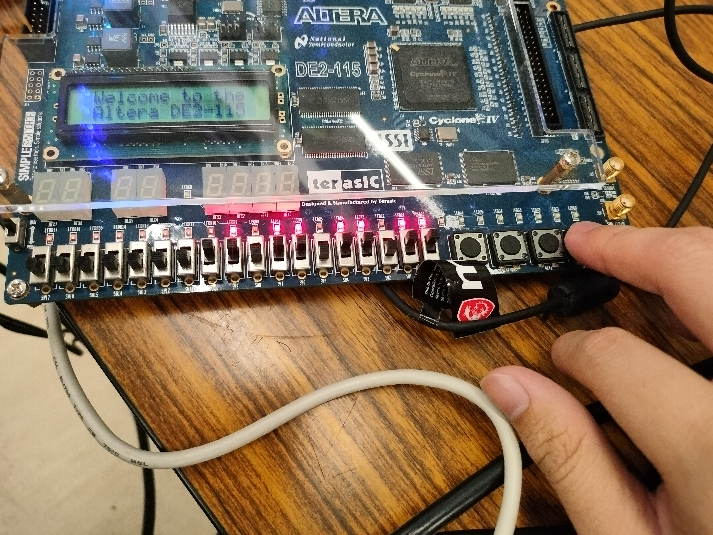
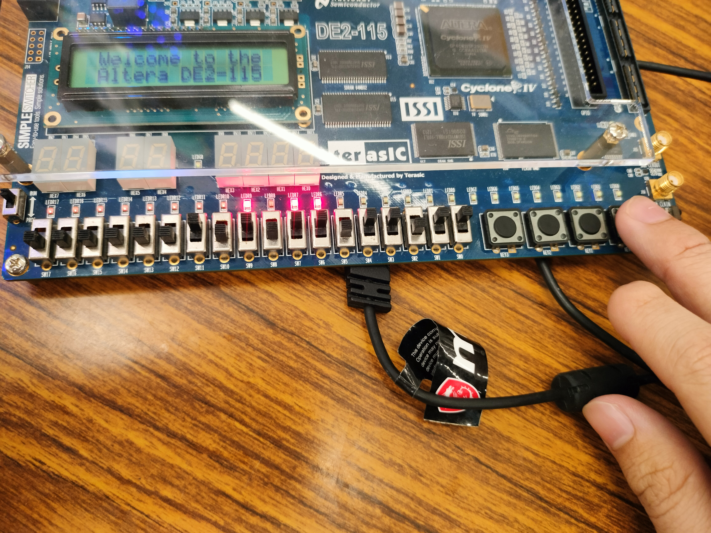
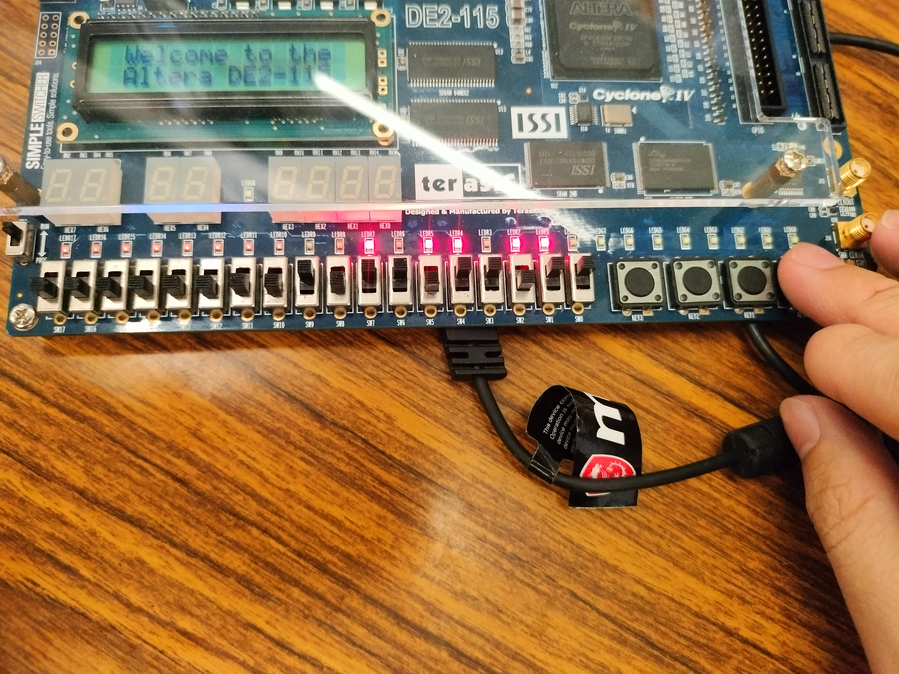
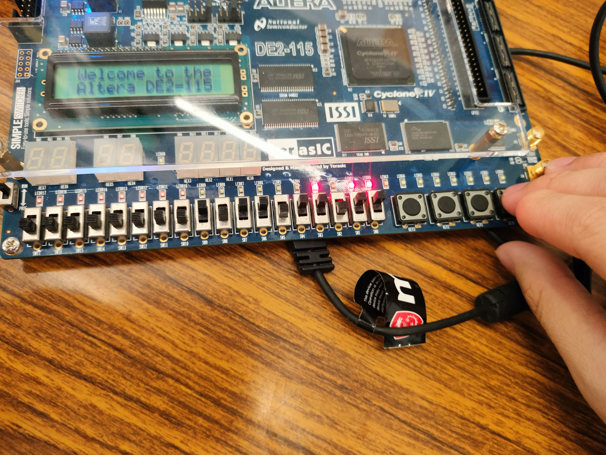
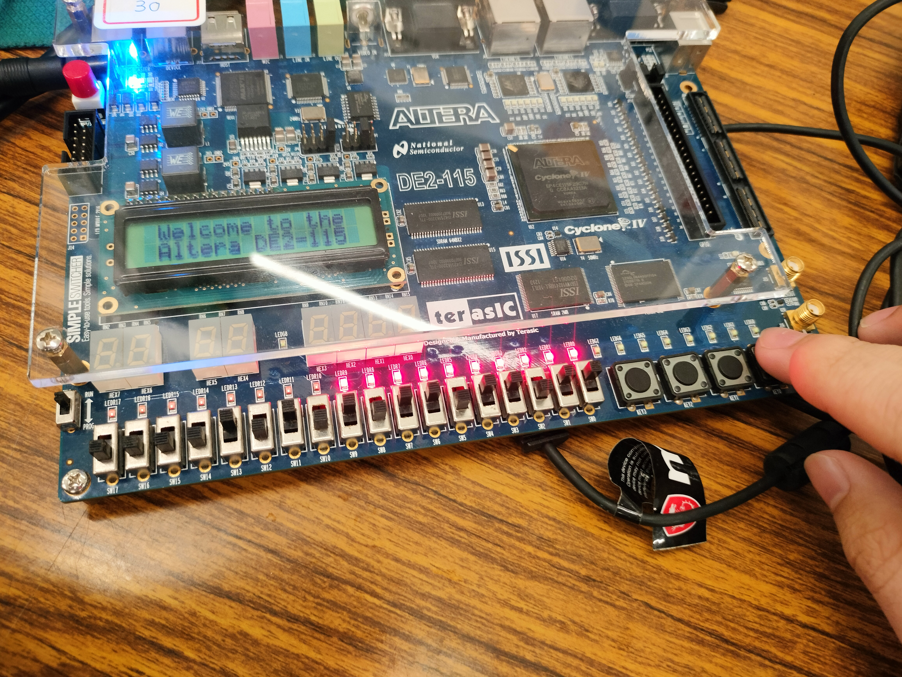

# 實驗報告：N位元左/右移位萬用暫存器設計

**課程名稱：** 微算機實驗 (2026)  
**實驗編號：** Lab 05  
**實驗主題：** 使用 GENERIC 與 FOR LOOP 實作通用型移位暫存器

---

## 一、 實驗目的
1. **學習使用 VHDL 的 GENERIC 關鍵字**：建立具備可變位元長度的硬體模組，提高程式碼的重用性。
2. **掌握 PROCESS 區塊內的 FOR LOOP 語法**：透過迴圈結構簡潔地實作資料位移邏輯。
3. **實作並驗證萬用暫存器**：整合同步清除 (Clear)、平行載入 (Parallel Load) 與左/右移位功能。

---

## 二、 實驗原理與邏輯設計
本實驗設計一個 N 位元（在此實作為 10 位元）的同步電路，其行為受時脈 `clk` 正緣觸發。控制訊號優先權如下：

1. **同步清除 (clean='1')**：所有位元歸零。
2. **平行載入 (load='1')**：將輸入端 `di` 的數值直接載入。
3. **左移 (lr_sel='1')**：內容向 MSB 移動，LSB 補入串列輸入 `sdi`。
4. **右移 (lr_sel='0')**：內容向 LSB 移動，MSB 補入串列輸入 `sdi`。

---

## 三、 實驗步驟與程式碼

### 1. VHDL 核心實作
本實驗採用行為級描述 (Behavioral Model)，利用 `FOR LOOP` 處理位元移動。

```vhdl
-- N_bit_DFF.vhd 核心邏輯
process(clk)
begin
    if rising_edge(clk) then
        if clean = '1' then
            reg <= (others => '0');
        elsif load = '1' then
            reg <= di;
        elsif lr_sel = '1' then
            for i in N-1 downto 1 loop
                reg(i) <= reg(i-1);
            end loop;
            reg(0) <= sdi;
        elsif lr_sel = '0' then
            for i in 0 to N-2 loop
                reg(i) <= reg(i+1);
            end loop;
            reg(N-1) <= sdi;
        end if;
    end if;
end process;
```

### 2. 硬體腳位配置 (Pin Assignment)
| 訊號名稱 | 功能說明 | FPGA 腳位 (Cyclone IV E) |
|---|---|---|
| `clk` | 時脈輸入 | PIN_M23 (KEY0) |
| `clean` | 同步清除 | PIN_AB23 (SW12) |
| `load` | 平行載入 | PIN_AC24 (SW10) |
| `lr_sel` | 移位方向 (1:L, 0:R) | PIN_AB24 (SW11) |
| `sdi` | 串列輸入 | PIN_AA24 (SW13) |
| `di[9..0]` | 10位元平行輸入 | PIN_AB25 ~ PIN_AB28 |
| `qo[9..0]` | 10位元輸出 (LED) | PIN_G17 ~ PIN_G19 |

---

## 四、 實驗結果與驗證

### 1. 功能驗證 (Waveform / Hardware)
* **驗證點 A (Load)**：當 `load` 為高電位時，LED 應立即顯示 `di` 的開關狀態。
* **驗證點 B (Shift)**：切換 `lr_sel` 並按壓 `clk` (KEY0)，觀察 LED 燈是否依序左右移動。

### 2. 實作照片紀錄
| 狀態描述 | 實體照片 |
| :--- | :--- |
| **同步清除** |  |
| **平行載入** |  |
| **左移過程** |  |
| **串列輸入 (SDI)** |  |
| **右移操作** |  |

---

## 五、 結論與心得
1. **GENERIC 的彈性**：透過 GENERIC 設定 N=10，我們不需要修改核心邏輯即可快速調整暫存器寬度。
2. **FOR LOOP 的硬體實現**：在 PROCESS 內使用 FOR LOOP 被合成器轉化為平行的硬體連線，實作效率極高。
3. **同步邏輯**：同步清除確保了電路在時脈控制下的穩定性，是數位系統設計的核心原則。

---

## 六、 組員貢獻比例
| 姓名 | 學號 | 貢獻比例 | 負責內容 |
| :--- | :--- | :--- | :--- |
| 楊承諭 | 113590051 | 75% | 程式開發、硬體測試 |
| 黃楷程 | 113590017 | 25% | 報告撰寫 |
