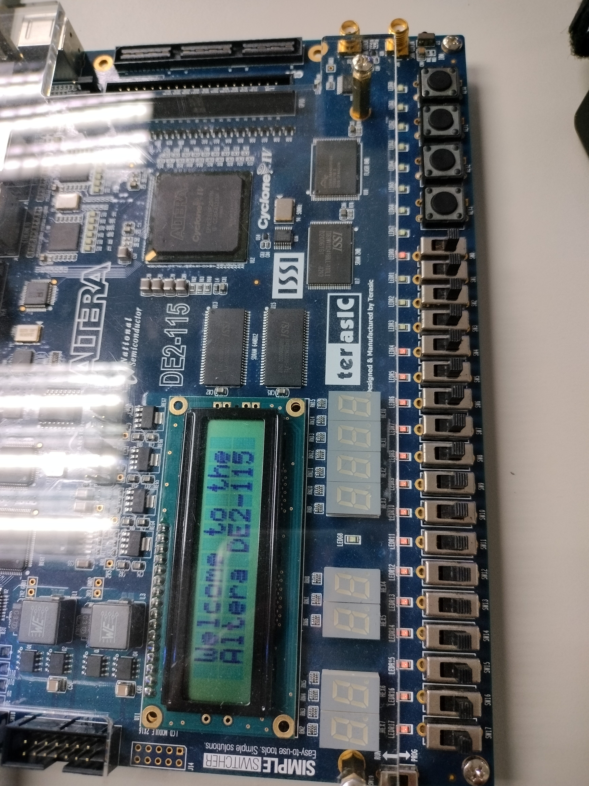
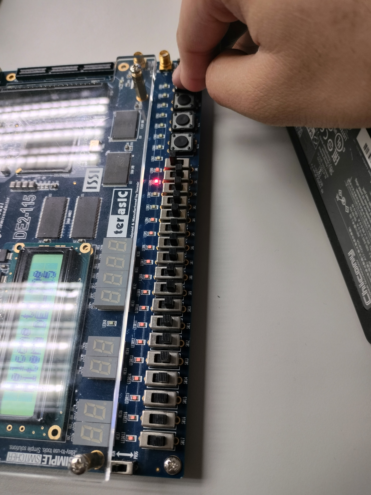
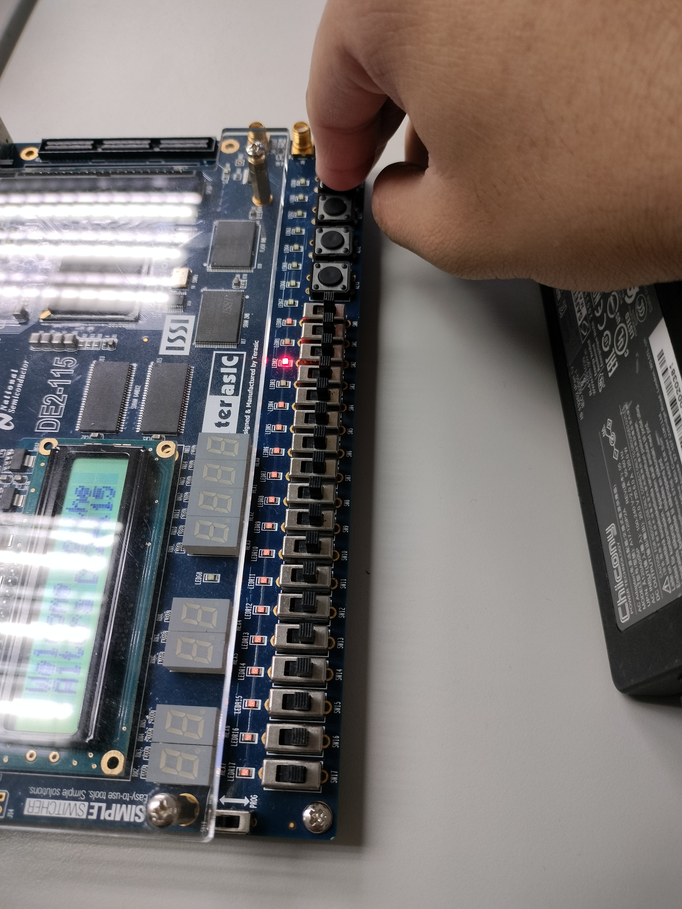
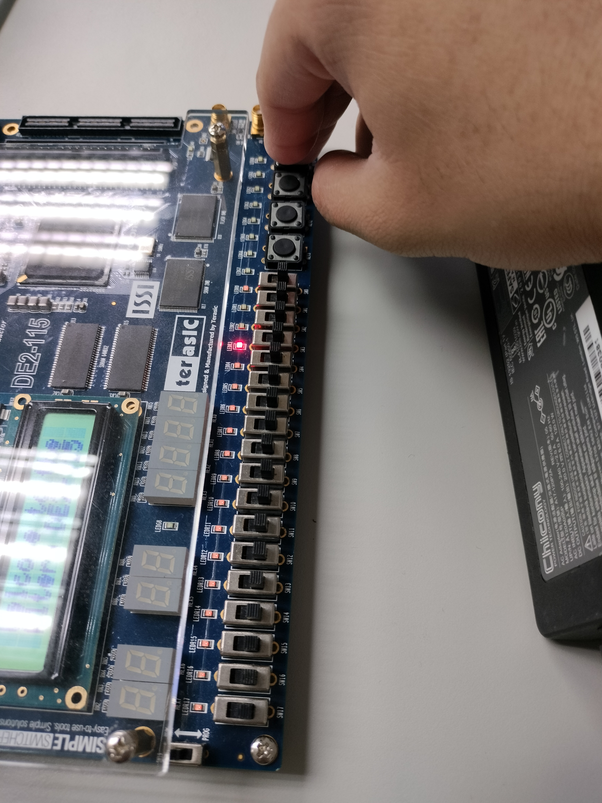
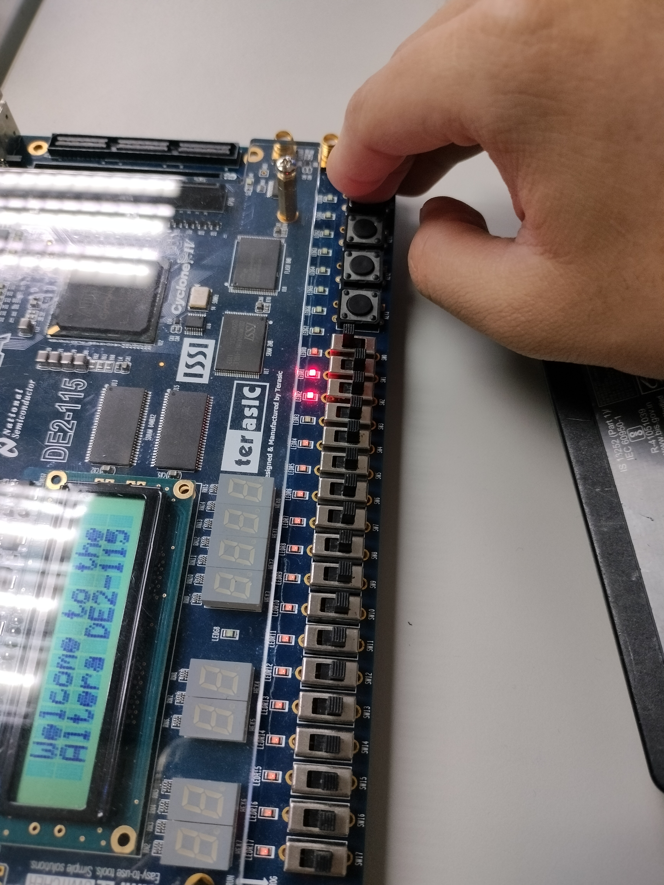
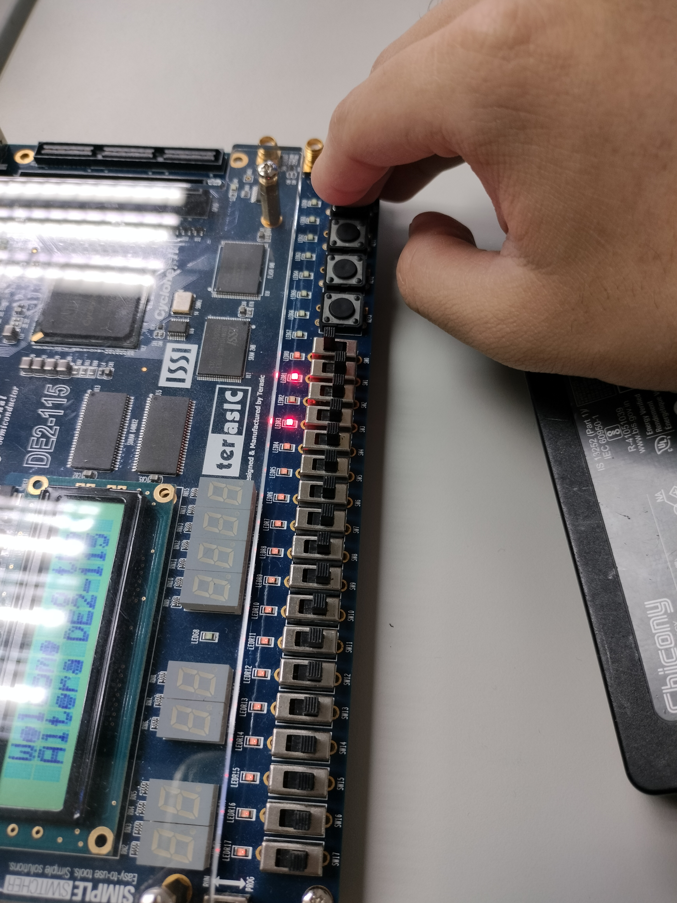
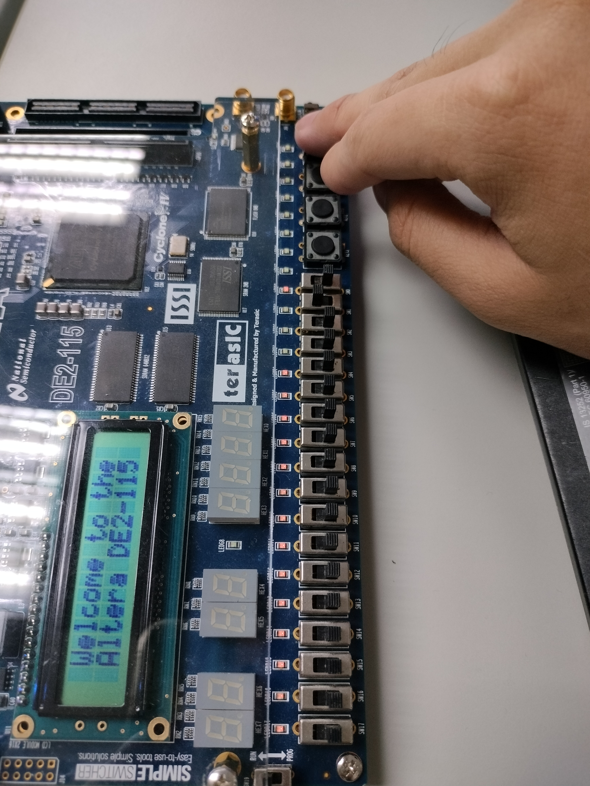

# 微處理器系統實驗報告 - Lab 06

**系級：** 資工二  
**組別：** 第19組  
**學號/姓名：** 113590051 / 楊承諭、113590017 / 黃楷程  
**日期：** 2026/05/13  

---

## 組員貢獻比例

| 姓名 | 學號 | 貢獻比例 | 負責內容 |
| :--- | :--- | :--- | :--- |
| **楊承諭** | 113590051 | 100% | 小組專案製作與小組報告製作 |
| **黃楷程** | 113590017 | 0% | 無貢獻內容 |

---

## 一、實驗內容

本次實驗的主題為「位移除法器 (Shift Divider) 之有限狀態機 (FSM) 設計」。實驗目標是使用 VHDL 語言在 FPGA 開發板上實現一個控制除法運算流程的控制器。該控制器需根據輸入訊號（如餘數正負號、運算次數等）來決定下一個狀態，包含初始狀態 (Start)、比較與判斷 (S1)、數值更新 (S2a/S2b)、計數與迭代 (S3) 以及完成狀態 (S4)。

透過本實驗，我們學習了：
1. 如何將狀態轉移圖 (State Transition Diagram) 轉換為 VHDL 程式碼。
2. 同步電路中 `clk` 與 `reset` 的應用。
3. 使用 Quartus 進行編譯、腳位分配與硬體驗證。

---

## 二、實驗過程及結果

### 1. 實驗過程
- 根據實驗手冊提供的狀態轉移表，撰寫 VHDL 程式碼定義 `state_type` 與 `next_state` 邏輯。
- 在 Quartus 中建立專案，並分配正確的 FPGA 腳位（PIN_M23 為時脈，PIN_AC28 為重設，PIN_AB28 為輸入 `w`）。
- 使用開發板上的 LED 燈 (PIN_F21, PIN_E19, PIN_F19) 來觀察 3-bit 的狀態輸出。

### 2. 實驗結果（狀態轉換截圖）


*圖 1: Start 狀態 (000)*


*圖 2: 進入 S1 狀態 (001)*


*圖 3: 條件滿足進入 S2a (010)*


*圖 4: 進入 S3 (100)*


*圖 5: 條件不滿足進入 S2b (011)*


*圖 6: S2b 轉至 S3 (100)*


*圖 7: 運算結束進入 S4 (101)*


*圖 8: 按下 Reset 回到初始狀態*

---

## 三、實驗心得

在本次 Lab 06 的實驗中，我們主要探討了如何利用 VHDL 語言來實作一個應用於「位移除法器（Shift Divider）」的有限狀態機（Finite State Machine, FSM）。這項實驗不僅讓我們深入理解了除法運算的硬體邏輯，更強化了我們對於狀態轉移圖與實際硬體描述語言之間轉換的掌握能力。

實驗的核心在於精確定義六個不同的狀態：Start、S1、S2a、S2b、S3 以及 S4。我們學習到如何根據輸入訊號 `w` 的狀態（例如代表餘數是否大於零，或是迴圈次數是否達到門檻）來驅動狀態的跳轉。在 S1 階段進行判斷，並依據結果進入 S2a 或 S2b 處理不同的數值路徑，最後透過 S3 進行計數判別，決定是要回到 S1 繼續迭代還是進入完成狀態 S4。

在實作過程中，我們體會到同步電路設計中「時脈觸發（clk）」與「同步/非同步重設（reset）」的重要性。透過 Quartus 軟體的編譯與開發環境，我們將設計好的 FSM 邏輯與硬體腳位進行對應，並利用 LED 燈的 3 位元編碼（000 到 101）來即時監測目前的狀態轉換。

這種將抽象邏輯具象化為實際硬體訊號的過程，讓我們對於微處理器內部控制單元的運作有了更直觀的認識。雖然在撰寫 VHDL 過程初期，對於 `next_state` 的組合邏輯判斷稍有困惑，但透過反覆比對實驗手冊中的狀態轉換表，我們成功克服了邏輯上的盲點。這次實驗不僅讓我們掌握了 FSM 的 VHDL 撰寫技巧，也讓我們對除法器這種複雜算術單元的控制流程有了更深刻的體會，這對於未來設計更複雜的數位系統奠定了紮實的基礎。

---

## 四、程式碼 (FSM.vhd)

```vhdl
library ieee;
use ieee.std_logic_1164.all;
use ieee.std_logic_unsigned.all;

-- Lab 06: FSM for Shift Divider
-- Based on the provided state machine diagram and transition table.

entity FSM is
    port(
        clk    : in  std_logic; -- PIN_M23 (KEY[0])
        reset  : in  std_logic; -- PIN_AC28 (SW[1])
        w      : in  std_logic; -- PIN_AB28 (SW[0])
        output : out std_logic_vector(2 downto 0) -- PIN_F21, PIN_E19, PIN_F19 (LEDs)
    );
end entity FSM;

architecture Behavioral of FSM is
    -- Define state type using names from the lab presentation
    type state_type is (Start, S1, S2a, S2b, S3, S4);
    signal current_state, next_state : state_type;
begin

    -- Synchronous State Transition
    process(clk, reset)
    begin
        if reset = '1' then
            current_state <= Start;
        elsif rising_edge(clk) then
            current_state <= next_state;
        end if;
    end process;

    -- Combinatorial Next State Logic
    process(current_state, w)
    begin
        case current_state is
            when Start =>
                if w = '1' then
                    next_state <= S1;
                else
                    next_state <= Start;
                end if;

            when S1 =>
                -- w=0: Remainder >= 0, w=1: Remainder < 0
                if w = '0' then
                    next_state <= S2a;
                else
                    next_state <= S2b;
                end if;

            when S2a =>
                -- Transition to S3 regardless of w
                next_state <= S3;

            when S2b =>
                -- Transition to S3 regardless of w
                next_state <= S3;

            when S3 =>
                -- w=0: repetitions < 9 (Not Done), w=1: 9th repetition (Done)
                if w = '0' then
                    next_state <= S1;
                else
                    next_state <= S4;
                end if;

            when S4 =>
                -- Done state, stay here or can be reset
                next_state <= S4;

            when others =>
                next_state <= Start;
        end case;
    end process;

    -- Output Assignment (3-bit state representation)
    -- Start: 000, S1: 001, S2a: 010, S2b: 011, S3: 100, S4: 101
    process(current_state)
    begin
        case current_state is
            when Start => output <= "000";
            when S1    => output <= "001";
            when S2a   => output <= "010";
            when S2b   => output <= "011";
            when S3    => output <= "100";
            when S4    => output <= "101";
            when others => output <= "000";
        end case;
    end process;

end architecture Behavioral;
```